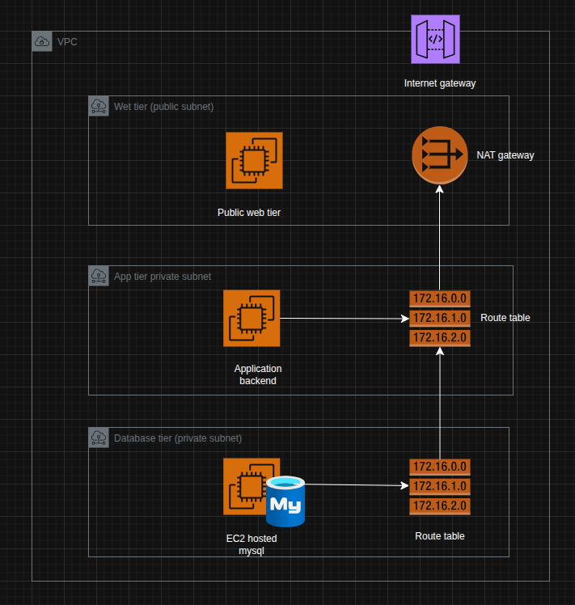
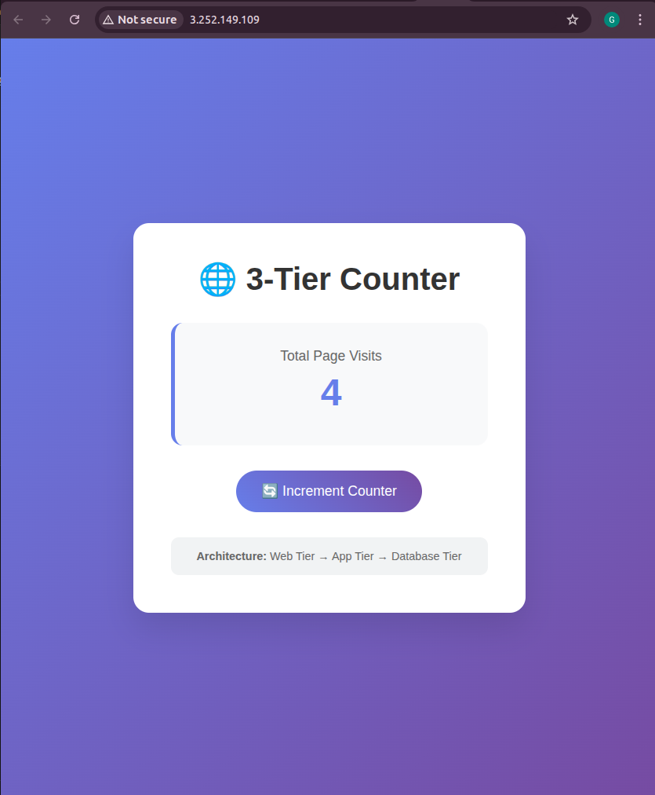

# 3-Tier LAMP Stack Application

A modern 3-tier web application deployed on AWS using Terraform, featuring a page visit counter with a beautiful UI.

## Architecture



## UI



## Components

### Tier 1: Web Layer (Frontend)
- **Technology**: PHP + Apache
- **Location**: Public subnet with internet access
- **Purpose**: Serves the user interface and displays visit counter
- **Features**: Modern responsive UI with gradient design

### Tier 2: Application Layer (API)
- **Technology**: PHP + Apache
- **Location**: Private subnet (no direct internet access)
- **Purpose**: Handles business logic and database interactions
- **API Endpoint**: `/api.php` - increments and returns visit count

### Tier 3: Database Layer
- **Technology**: MySQL 8 (Docker container)
- **Location**: Database subnet (isolated)
- **Purpose**: Stores visit counter data
- **Table**: `counters` with auto-incrementing visit count

## Infrastructure

- **VPC**: Custom VPC with public, private, and database subnets across 2 AZs
- **Security Groups**: Properly configured with least privilege access
- **Key Pair**: Auto-generated SSH key pair for instance access
- **NAT Gateway**: Enables private subnet internet access for updates

## Prerequisites

- AWS CLI configured with appropriate credentials
- Terraform >= 1.0
- AWS account with EC2, VPC, and RDS permissions

## Variables

The following variables can be customized during deployment:
- `database_name` - MySQL database name (default: "appdb")
- `database_password` - MySQL root password (required)

## Deployment

1. **Clone and navigate to terraform directory**:
   ```bash
   cd terraform/
   ```

2. **Initialize Terraform**:
   ```bash
   terraform init
   ```

3. **Plan deployment** (with custom variables):
   ```bash
   terraform plan -var="database_password=YourSecurePassword123" -var="database_name=myapp"
   ```

4. **Deploy infrastructure** (with custom variables):
   ```bash
   terraform apply -var="database_password=YourSecurePassword123" -var="database_name=myapp"
   ```
   
   Or use default database name:
   ```bash
   terraform apply -var="database_password=YourSecurePassword123"
   ```

5. **Access the application**:
   - Get the web server public IP from outputs
   - Visit `http://<web_instance_public_ip>` in your browser

## Outputs

After deployment, Terraform provides:
- `web_instance_public_ip` - Access URL for the application
- `web_instance_public_dns` - Public DNS name
- `key_pair_name` - SSH key pair name
- `private_key_file` - Path to private key for SSH access

## SSH Access

SSH into instances using the generated key:
```bash
# Web tier (public)
ssh -i lamp_stack_key.pem ec2-user@<web_public_ip>

# App/DB tiers (via bastion/web instance)
ssh -i lamp_stack_key.pem -J ec2-user@<web_public_ip> ec2-user@<private_ip>
```

## Security Features

- **Network Isolation**: Each tier in separate subnets
- **Security Groups**: Restrictive rules allowing only necessary traffic
- **No Direct DB Access**: Database only accessible from app tier
- **SSH Keys**: Secure key-based authentication

## File Structure

```
terraform/
├── main.tf           # Main infrastructure configuration
├── outputs.tf        # Output definitions
├── provider.tf       # Provider configuration
└── lamp_stack_key.pem # Generated SSH private key
```

## Cleanup

To destroy the infrastructure:
```bash
terraform destroy
```

## Customization

- Modify `locals` in `main.tf` to change naming
- Adjust instance types for different performance requirements
- Update security group rules as needed
- Customize the UI by modifying the PHP code in user_data

## Troubleshooting

- Check user_data logs: `/var/log/cloud-init-output.log`
- Verify security group rules allow required traffic
- Ensure NAT Gateway is properly configured for private subnet access
- Check MySQL container status: `docker ps` on database instance